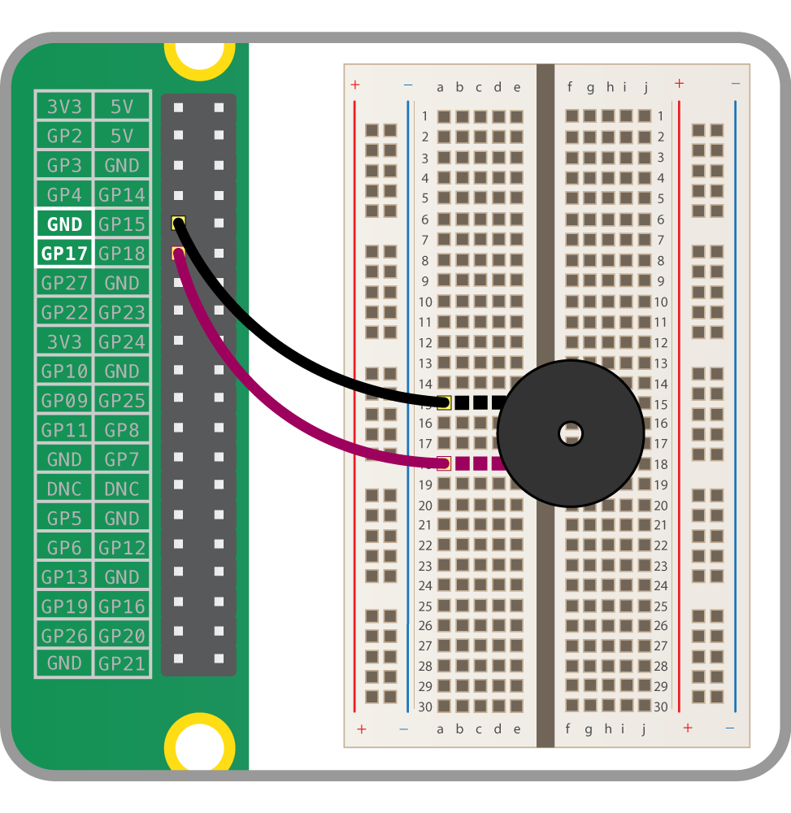

Hay dos tipos principales de bocinas o zumbadores: **activo** y **pasivo**.

Un zumbador pasivo emite un tono cuando se le aplica voltaje. También requiere una señal específica para generar una variedad de tonos. Las bocinas activas son mucho más fáciles de usar, por lo que las trataremos aquí.

### Conectando una bocina

Se puede conectar un zumbador activo como un LED, pero como son un poco más robustos, no necesitarán una resistencia para protegerlos.

Configura el circuito como se muestra a continuación:

