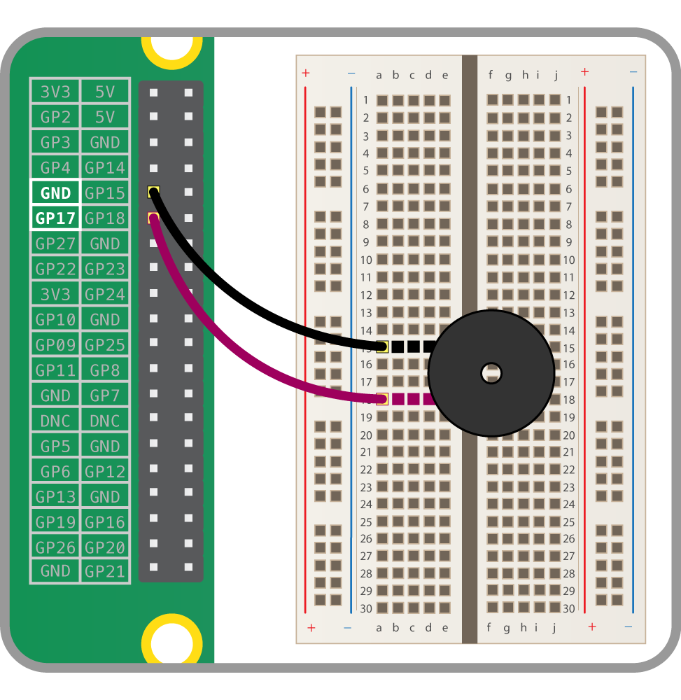

버저에는 두 가지 타입이 있습니다: **액티브 버저** 와 **패시브 버저** 가 있습니다.

패시브 버저는 특정한 주파수가 가해졌을 때 신호음을 발생시킵니다. 또한 다양한 톤을 생성하기 위해서는 특정한 시그널이 필요합니다. 액티브 버저의 경우에는 단지 전원만 가하면 버저음이 울리므로 사용이 훨씬 간단합니다. 여기서는 액티브 버저에 관해서 다룹니다.

### 버저 연결하기

액티브 부저는 LED처럼 연결할 수 있지만 LED보다는 조금 더 견고하기 때문에 부품을 보호하기 위한 저항이 특별히 필요하지 않습니다.

아래와 같이 회로를 구성할 수 있습니다:

